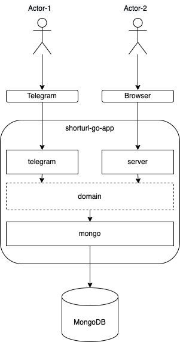

# SHORTURL-GO-APP
Simple telegram-bot and server implement url shorter function.

Bot available here - [t.me/MontyShorty_bot](https://t.me/MontyShorty_bot)

# Goal
The project was created for 2 purpose:
* Learn Golang with "Real World Application" example
* Add this one to CV

## TODO
* Add link follow counter

# Environment variables
| Variable               | Description                                                                                                                                                   | Example                                   | Default value                                            |
|------------------------|---------------------------------------------------------------------------------------------------------------------------------------------------------------|-------------------------------------------|----------------------------------------------------------|
| `MONGO_URL`            | Connection URL to database                                                                                                                                    | `mongo://mongodb.node1.com:27017`         | `mongo://localhost:27017`                                |
| `TELEGRAM_BOT_API_KEY` | API key need to interact with telegram Bot                                                                                                                    | `8294723453:R08gVE8gRlVDSyBZT1VSIFNFTEY=` | No default value, you should specify this one explicitly |
| `URL_PREFIX`           | URL prefix, which bot will add to generated short URL    If you specify `http://xyz.io/`, short URL will be generated like `http://xyz.io/` + `Xu6ZK` | `https://your-domain.com/`                | `http://localhost:8080/`                                 |
| `PORT`                 | Port on which server will be start                                                                                                                            | `443`                                     | `8080`                                                   |

# How to run

There's one prerequisite for running the app. You should [create Bot via Telegram BotFather](https://core.telegram.org/bots#3-how-do-i-create-a-bot) and specify `TELEGRAM_BOT_API_KEY` environment variable 
(just create .env file with that string: `TELEGRAM_BOT_API_KEY=<YOUR_API_KEY>` in project root)

After this done, run docker compose:

`docker-compose pull && docker-compose up -d`

That's it!
	
# Architecture

The application has two component for interacting with a user:
* `telegram` - package encapsulate Telegram API connection logic and provide handlers for Bot chat messages
* `server` - server serve HTTP requests from users and response 302 Redirect if request path contain valid short URL

`domain` package contain central business entity `ShortURL` and provide two interfaces to interact with this entity:
* `CreateShortURL(context.Context, *ShortURL) (string, error)`
* `GetOriginUrl(context.Context, string) (*ShortURL, error)`

DAO package `mongo` contain logic to interact with mongoDB and implement `ShortURL` interfaces.
